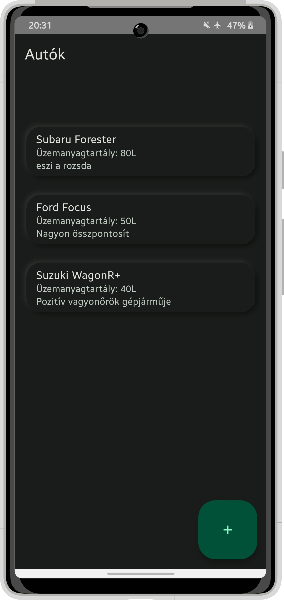
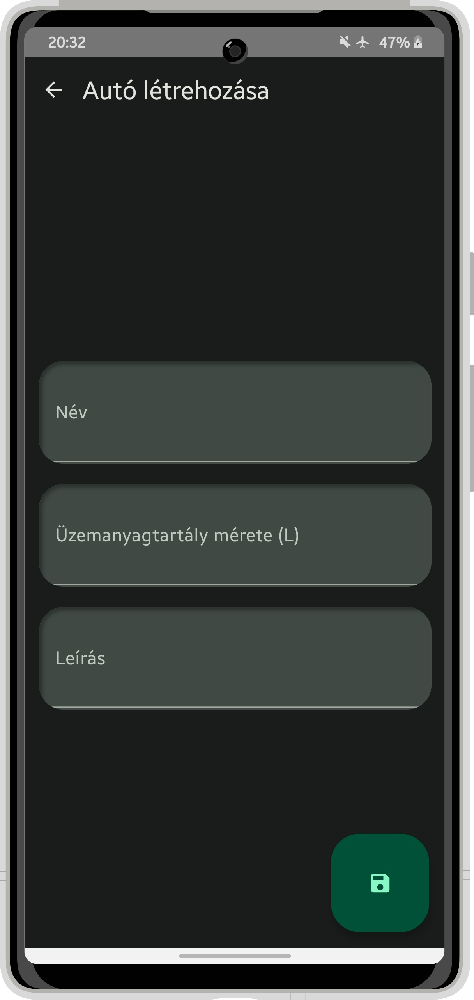
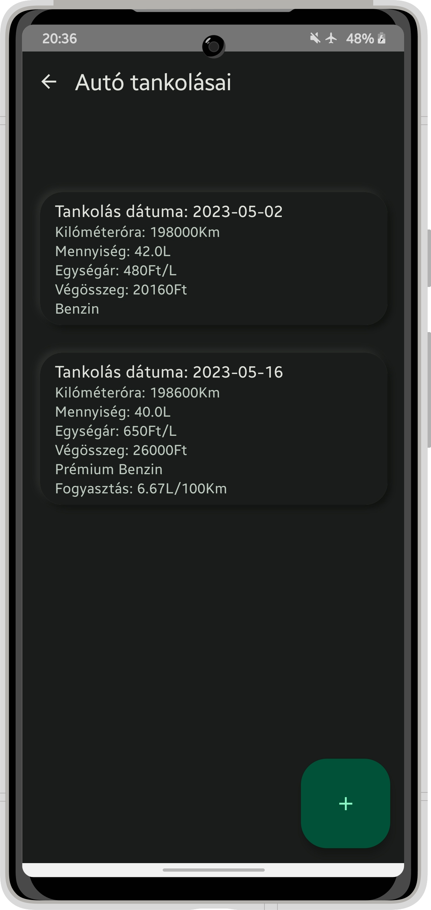
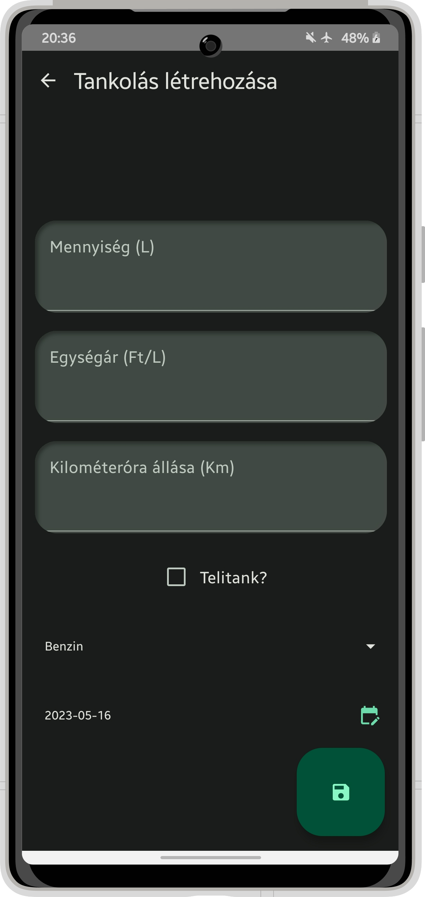

# Házi feladat specifikáció

Információk [itt](https://viauav21.github.io/laborok/hf)

## Androidalapú szoftverfejlesztés
### 2023.04.30. - 2022/23/2
### Szelle Csaba - (QK9MU4)
### sz.csaba.2002@gmail.com
### Laborvezető: Kövesdán Gábor

## Bemutatás

Tankolás nyilvántartó

Az alkalmazás lehetővé teszi az autók tankolási előzményeinek nyilvántartását, beleértve a dátumot, az üzemanyag típusát, az árat, a tankolt mennyiséget és az autó kilométeróra állását a tankolás idején.
Az ötlet eredete az édesapámtól származik, aki szükségét érezte egy ilyen nyilvántartó alkalmazásnak.
A célközönség minden olyan ember, aki igényli ezt a fajta nyilvántartást, és nem szeretné papíron vezetni.

## Főbb funkciók

Az alkalmazás lehetővé teszi az autók és azokhoz tartozó tankolások rögzítését és tárolását, valamint azok megjelenítését.
Az alkalmazás 4 nézetet tartalmaz: az autók listáját, az adott autóhoz tartozó tankolások listáját, ahol új tankolásokat lehet felvenni, valamint az új autók felvételére szolgáló nézetet.
Új autó, valamint tankolás felvételéhez a kijelző jobb alsó sarkában található „+” gombot kell használni.
A tankolás dátumát kényelmesen ki lehet választani, egy naptár segítségével.
Lista nézetben a tankolást hosszan nyomva elküldhetjük másoknak, szöveges üzenet formájában.

## Választott technológiák:

Az alkalmazás fejlesztése során használt technológiák tételes felsorolása. Az, hogy mi számít technológiának a laborokon ismertetésre kerül, a laborvezetőkkel tovább pontosítható. 
5 technológia használata javasolt. Például:

- UI: A felhasználói felület Jetpack Compose-ban és MVVM architektúrával.
- Lista: A tankolások egy-két fontosabb részlettel együtt egy komplex listában jelennek meg. 
- Stílus: Az alkalmazás stílusa eltér az alapértelmezett színektől, megjelenéstől. 	
- Adatbáziskezelés: Az alkalmazás elmenti a rögzített autókat és tankolásokat és perzisztensen tárolja.
- Megosztás: Lista nézetben a tankolást hosszan nyomva elküldhetjük másoknak, szöveges üzenet formájában.

___

# Házi feladat dokumentáció

### Tankolás nyilvántartó

## Bemutatás

Az alkalmazás lehetővé teszi az autók tankolási előzményeinek nyilvántartását, beleértve a dátumot, az üzemanyag típusát, az árat, a tankolt mennyiséget és az autó kilométeróra állását a tankolás idején.
Az ötlet eredete az édesapámtól származik, aki szükségét érezte egy ilyen nyilvántartó alkalmazásnak.
A célközönség minden olyan ember, aki igényli ezt a fajta nyilvántartást, és nem szeretné papíron vezetni.

## Főbb funkciók

Az alkalmazás lehetővé teszi az autók és azokhoz tartozó tankolások rögzítését és tárolását, valamint azok megjelenítését.
Az alkalmazás 4 nézetet tartalmaz: az autók listáját, az adott autóhoz tartozó tankolások listáját, ahol új tankolásokat lehet felvenni, valamint az új autók felvételére szolgáló nézetet.
Új autó, valamint tankolás felvételéhez a kijelző jobb alsó sarkában található „+” gombot kell használni.
A tankolás dátumát kényelmesen ki lehet választani, egy naptár segítségével.
Lista nézetben a tankolást hosszan nyomva elküldhetjük másoknak, szöveges üzenet formájában.

## Felhasználói kézikönyv

Az alkalmazás indításakor az autók listája tárul a szemünk elé. Itt alálható minden autó neve, üzemanyagtartályuk mérete, valamint egy rövid leírás az autóhoz.
A képernyő jobb alsó sarkában található gombbal új autókat tudunk létrehozni. A gomb megnyomása után egy másik nézet nyílik meg, ahol az adatok beírása után fel tudjuk venni az új autónkat a listába, miután a jobb alul található mentés gombbal véglegesítjük a felvételt. Amennyiben meggondoltuk magunkat, a képernyő bal felső sarkában található nyíllal visszaléphetünk az autók listájára. Amennyiben van felvett autónk, az adott autóra rákattintva megnyithatjuk az autó tankolásait, de ha nyomva tartjuk, akkor törölhetjük is a listából.

1. ábra (bal oldalon): Az autók listája: látható az autók nevei, üzemanyagtartályainak méretei, valamint a leírásai. 
2. ábra (jobb oldalon): Új autó felvétele: a mezők kitöltése után egy új autót tudunk felvenni

A tankolásoknál egy hasonló listával találkozunk, mint az előzőnél. A különbség csupán annyi, hogy most az autóhoz tartozó tankolássokal találjuk magunkat szembe. A tankolásnak láthatjuk a dátumát, hogy az adott pillanatban mennyi volt az autó óraállása, hány litert tankoltunk, mennyi volt az egységára, valamint összesen mennyit fizettünk, plusz opcionálisan a fogyasztásunkat is láthatjuk. A jobb alsó sarokban található gombra kattintva a átkerülünk a tankolás létrehozó nézetre, ahol a mezőket kitöltve, majd ezután a mentés gombra kattintva felvehetjük a tankolást. Különleges mező a jelölőnégyzet a teli tankhoz, amelyet bejelölve megjeleníthetjük a listában fogyasztást. Természetesen itt is vissza tudjuk vonni a felvételt a jobb felső sarokban található gombbal. A listaelemre kattintással megoszthatjuk a tankolást, valamint hosszan nyomva törölhetjük azt.

3. ábra (bal oldalon): Az tankolások listája: látható a tankolások dátuma, fogyasztás, árak, mennyiség
4. ábra (jobb oldalon): Új tankolás felvétele: a mezők kitöltése után egy új tankolást tudunk felvenni

## Felhasznált technológiák:

- **Room** alapú adattárolás, Objektumrelációs leképezés
- **Jetpack Compose** használata a felhasználói felületek elkészítésére
- A jobb átláthatóság érdekében **összetett listák** alkalmazása
- [Neumorphism UI design](https://devlibrary.withgoogle.com/products/android/repos/sridhar-sp-compose-neumorphism) használata, a vezérlők térbeli hatásának kiváltásához
- [Material3 design](https://m3.material.io/theme-builder#/custom) színek használata, az alkalmazás egységes, igényes megjelenéséhez
- Intent használata, a **tankolások megosztásához**

## Fontosabb technológiai megoldások

**Számomra a legnehezebb technológia maga a UI, valamint a jetpack compose volt.
Mivel volt már view-based android alkalmazásom, így ez jelentette a legnagyobb újdonságot, mert eddig ismeretlen volt számomra ez a megközelítés.
Tetszett, hogy egy teljesen új megközelítést alkalmaz, bár megvannak a saját előnyei, és hátrányai: pl. a preview-ra sokat kell várni.
Nehézséget jelentett, hogy viszonylag nagy a boilerplate (legalábbis szerintem, pedig a jetpack egyik célkitűzése ennek megszűntetése), de ez később a fejlesztés során előnyömre vált.
A legnagyobb problémát ez jelentette: nem tudtam kiigazodni az osztályok felelősségén, hogy mvvm struktúrában mit hova implementáljak, hogyan válasszam szét elegánsan a felelősségeket.
Az alkalmazást adatrétegtől felfelé kezdtem el felépíteni, ami egy viszonylag konzisztens megközelítést nyújtott (nem nagyon volt compile error a köztes állapotokban), viszont ez azt jelentette, hogy élesben csak akkor tudtam kipróbálni, amikor volt egy valamennyire működő UI-om.
Mivel a technológia annyira friss, ezért még az interneten is erősen limitált a rendelkezésre álló segítség, a mesterséges intelligencia meg még elég pontatlan válaszokat ad.
Egyedüli hiteles forrást a hivatalos android dokumentációja, valamint a tárgy oktatói gárdája jelentette.
Ezt úgy oldottam meg, hogy átnéztem néhány labor kódját, valamint elolvastam a labor feladatleírásait.
Így már tudtam, hogy mit hol kell implementánom, hogyan válasszam szét a rétegek felelősségeit.**